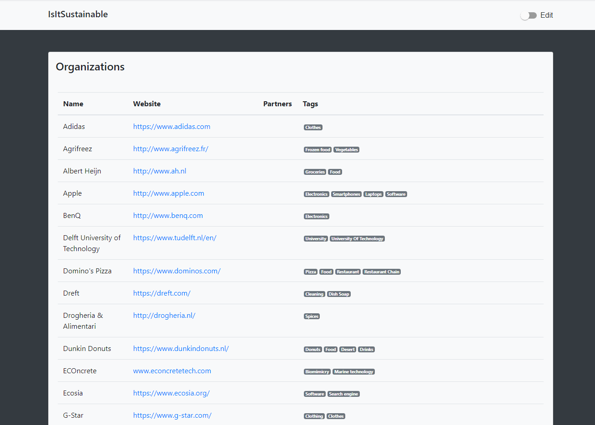

# IsItSustainable 
A website on which a user can lookup the sustainability of any organization. And if they want to, submit data which can add to their overall sustainability report. 



## i. Core Concepts

### a. Crowd controlled
All sumbitted data is crowd controlled. Why do we want it to be crown controlled?
- There's an impossible amount of organizations to submit and research for a single person, using crowd submissions only requires a *review* step per submission and makes this manageable
- People will be more involved with the idea/concept of sustainability in general

There are mutiple types of possible submissions:

### b. Data quality
In order to make sure the data is usefull there are several strategies
- Reviewing system 
    No new user submission immediatally enter the database. There's first a *staging* state in which reviewing has to be done. This can be done by hand by a selected group of neutral journalists and additionally an AI can filter out harmfull/nonsensical requests. Reviewers will make no judgment at all regarding the sustainability of the data or regarding the reliability of a submitted source. Only the quality will be checked. The crowd is in charge of determining what it's worth.
    
    This ensures only whether the information is
    - Correctly documented
    - Not duplicate
- Specific computing logic
    - Information is rated based on reliability
    - Information is rated on sustainability
    - Sustainability is seperated in 3 simple sections
- Accounts are required to sumit new data

### c. Multipurpose
This tool should be useable in multiple ways
- Sustainable shopping guide
- Communication/information facilitator 
- Organization evaluation guidelines

### d. All categories
Using a completely customizeable tagging system and by allowing all sorts of Organizations, all categories of organizations can be listed:
- Parent/daughter companies
- Freelancers
- Foundations
- Charities
- Government
  *etc.*

## ii. Documents
- [Conceptual documentation](documentation/Documentation.md)
- [UX design](documentation/UX.md)
- [Technical overview](documentation/Technical_Design.md)

## iii. Building
This repository consists of 2 sub projects:
1. A Java *Spring* project for the backend
2. An *Angular* project for the frontend

#### Prerequisites
- Node package manager (`npm`)
- Java 8 (at least)
    - Maven (`mvn`)
- (L)AMP stack
    *for instance XAMPP*
    - Apache
    - MySQL
    
Make sure MySQL and Apache/NGINX are running.

### 1. Backend
Spring guide: [Spring Boot Guide](https://docs.spring.io/spring-boot/docs/1.5.16.RELEASE/reference/html/using-boot-running-your-application.html)

#### a. application.properties file
Make sure you have or create a database for your build

Create an `application.properties` file in the folder `backend` with the following content:
```
spring.jpa.hibernate.ddl-auto=update

spring.datasource.url=<yourdatabaseurl>
spring.datasource.username=<username>
spring.datasource.password=<password>
spring.datasource.driver-class-name=com.mysql.cj.jdbc.Driver

security.basic.enabled=false
management.security.enabled=false

# Currently hardcoded communication port in Angular frontend
server.port=8082
```
Replace the placeholders by an URL to your database and specify the username and password for your database

#### b.. Run via maven
*In a CLI in directory 'backend'*
`mvn spring-boot:run` 

#### b. Or compile via maven and run jar file
*In a CLI in directory 'backend'* 
`mvn package` 
`java -jar ./target/<GeneratedJarFile> --spring.config.location="./application.properties"`

### 2. Frontend
*In a seperate CLI in directory 'frontend'* 

Install node-js dependecies
`npm install` 

Compile and host Angular server (on default port)
`ng serve`

### 3. Done!
Navigate in your browser to: [http://localhost:4200/](http://localhost:4200/)
