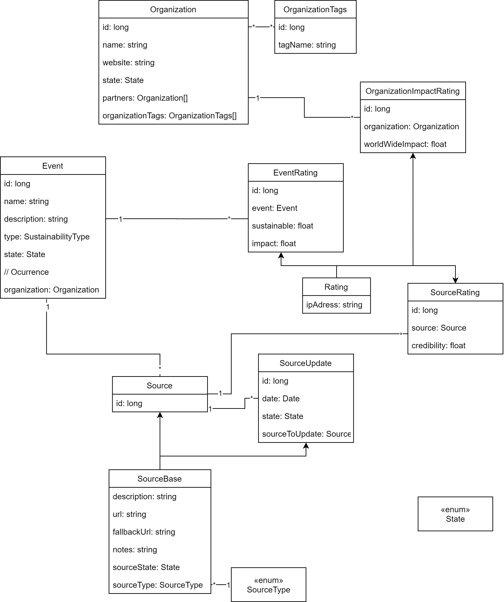
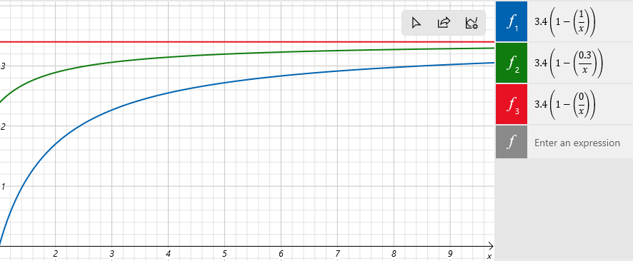

# Technical overview

In this document we list information regarding the techincal details of this project:
1. Technical features
2. Data objects
3. Class diagram
4. Algorithms
5. Improvements

## TODO
- Manage features with MoSCoW model
- Add documentation for all Algorithms
- Remove dutch text

## 1. Features
*An overview of technical feature we want to support*
- AI system filters new submissions for validity
- Keeping a history of changes to an element (to display this)
- Keeping denied elements (to be able display these) (for a period of time)
- All data should be stored normalized so that interactions can be changed in the future. (for instance upvote/downvote -> 0-5 stars)

## 2. Data objects
*This is an incomplete list of suggested data objects and their properties*

### Organization

Organization
- id: long (M)
- name: string (M)
- website: string
- partnerIds: Organization[]
- locations: OrganizationLocation[]
- tags: OrganizationTag[]

OrganizationImpactRating
> *to1 Organization
- id: long (M)
- organizationId: long (M)
- ipadress: string (M)
- wordwideImpact: int (0-5) (M)
> Basicaly the size of the company

OrganizationTag
> *to* Organization
> What does the company do? What do they sell?
- id: long (M)
- tag: string (M)

OrganizationLocation -> Enum
> *to* Organization
> should be <i>all</i> countries, continents and international
- id: long (M)
- location: string (M)

### Event

Event
> *to1 organization
- name: string
- description: string 
- ratings: EventRating[]
- sourceList: SourceList
- organizationId: long (M)
- type: SustainabilityType (M)

EventRating : Rating
> *to1 Event
- id: long (M)
- impact: float (0.0 - 1.0) (M)
- sustainable: int (-1.0 - 1.0) (M)
	> -1 being non-sustainable and +1 being very sustainable

### SustainabilityType

SustainabilityType -> Enum
> 1to* SourceList
> types: Climate, Animals, People
- id: long (M)
- type: string (M)

### SourceList

SourceList
> 1to1 event
- id: long (M)
- sources: ApprovedSource[]
- suggestions: PossibleSource[]
- denied: DeniedSource[]

### Source

ApprovedSource : Source
> *to1 SourceList
- id: long (M)
- sourceListId: long (M)
- ratings: SourceRating[]
- updates: SourceUpdate[]
- deniedUpdates: DeniedSourceUpdate[]

PossibleSource : Source
> *to1 SourceList
- id: long (M)
- sourceListId: long (M)

SourceType -> Enum
> 1to* Source
> Paper, 	Newspaper
- id: long (M)
- tag: string (M)

```typescript
Source {
- url: string // (M)
- sourceType: SourceType // (M)
- fallback url: string
- notes: string
}
```

```typescript
Rating {
- ipadress: string (M) / userId: long
}
```

## Class/Database Diagram


## Algorithms

### Current average rating from a list of ratings
The ratings could either be calculated everytime a new rating comes in on the server (which means lots of computations), Or they could be calculated on the client side (which means large data transfers). The following is a serverside optimization function for keeping track of average ratings.
```c++
// incremental serverside suggestion by explicity storing the AverageRating and AmountOfRatings
// Danger of incremental is chance of divergance, we could solve this by timed checks/updates
avgRating = (avgRating * amRatings + newRating) / (double)(amRatings++)
``` 
These optimized averaged rating values could be stored in structs which can be added to a map which has keys to the corresponding data.

### Global impact score
Global impact score can be calculated from the amount of impact ratings and the average impact rating. A compensationfactor `c` can control how much the amount-of-ratings influences the eventual global impact value

/N)
)

``` c++
/**
    @param compenstationForLowAmountOfRatings   The amount to compensate the globalImpact with based on the amount of ratings [0-1]
*/
float getGlobalImpactScore(float compenstationForLowAmountOfRatings) 
{
    double averageImpactRating = sum(impactRatings) / (double)impactRatings.size();
    return averageImpactRating * (1.0 - ( compenstationForLowAmountOfRatings / (double)amountOfImpactRatings ) );
}
```

The last line makes sure that only with a large number of ratings the displayed impact can actually be large. So that a small number of ratings doesn't mess up the overview.
`compenstationForLowAmountOfRatings` can be changed in order to modify this compensation factor and maybe find a sweet spot. (value must be in range 0 to 1, 0 being no compensation and 1 being full compensation. For experimental purposes exponential scaling can also be tested)



### Reliability score

#### Of a single Source
Here the same calculation as for the global impact applies. This is the general equations for this calculation
`rating = sum(ratings) / numRatings * (1 - (comp / numRatings))`

#### Of an Event based on all Sources
```c++
struct Source
{
	std::vector<double> ratings;  // values between 0 and 1 
};

struct Event
{
	std::vector<Source> sources;
	
	double getReliability() 
	{
		const double comp = 1.0; // finetune this
	
		// find the sum of all ratings of all sources and the total amount of ratings for all sources
		int numTotalRatings = 0;
		double sumOfAllRatings = 0;
		for(Source source : sources)
		{
			numTotalRatings += source.ratings.size();
			sumOfAllRatings += sum(source.ratings);
		}
		
		return sumOfAllRatings / numTotalRatings * (1 - (comp / numTotalRatings));`
	}
};
```

### Sustainability score
```c++
struct Event
{
	double reliability; 						// between 0 and 1
	std::vector<double> impactRatings;			// values between 0 and 1
	std::vector<double> sustainabilityRatings; 	// values between -1 and 1
	
	double getSustainabilityFactor()
	{
		const double comp = 1.0; // finetune this
		
		return average(sustainabilityRatings) * (1 - (comp / sustainabilityRatings.size());
	}
	
	double getImpactFactor()
	{
		const double comp = 1.0; // finetune this
		
		return average(impactRatings) * (1 - (comp / impactRatings.size());
	}
	
	// Returns a value between -1 and 1. -1 being very unsustainable, 0 being completely neutral and 1 being very sustainable.
	double getEventFactor()
	{
		return reliability * getSustainabilityFactor() * getImpactFactor();
	}
};

struct EventList
{
	std::vector<Event> events;
	
	getSustainability() 
	{
		const double comp = 1.0; // finetune this
		
		// Get all sustainability factors for all events. These sustainability factors already account for reliability and impact.
		// If reliability and/or impact are low, the sustainability factors are closer to zero, making the sustainability result neutral for unreliable and small events.
		std::vector<double> eventSustainabilityFactors;
		eventSustainabilityFactors.resize(events.size());
		for(Event event : events)
		{
			eventSustainabilityFactors[i] = event.getEventFactor();
		}
		
		return average(eventSustainabilityFactors) * (1 - (comp / eventSustainabilityFactors.size());
	}
};
```

## 5. Improvements
- (Dutch) Eigenlijk heb je een lijst van Events nodig, die een lijst van Sources bevat. Zodat sources gegroepeerd kunnen worden bij de events waar ze bij horen. Sources bevatten dan alleen een ```credibility``` rateable. Events bevatten dan een ```impact``` en een ```sustainable``` rateable. Zo zijn sources alleen maar de links naar bevestigingen van de events en kunnen events bijvoorbeeld een jaartal of een locatie bevatten. 
